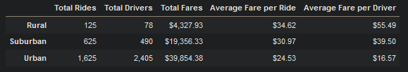
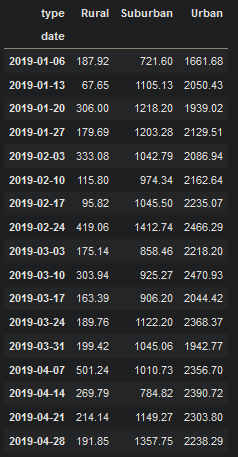
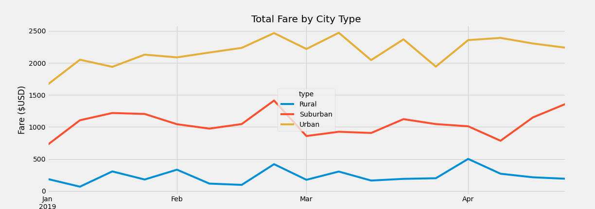

# PyBer_Analysis
## Overview
### This week we worked with PyBer the ride sharing company. We worked to find key info points, in order to help the company make smart and resourceful decisions on where to send more resources. The first thing we were tasked with was finding variables such as number of rides, the total drivers, the total fares, average fare per ride, and the average fare per driver in each city type. With all the information gathered here, we can create a DataFrame that tells you each city types: total drivers, total rides, total fares, average fare per ride, average fare per driver.

### Next was building a new DataFrame that indices "type" and "date" columns and sums the fare of those columns. Then we needed to reset the index of the new DataFrame. This is necessary to make the DataFrame into a pivot table. Creating the pivot table was simple, we made the index set to the date, columns seperated by city type, and the fare is the value based on city type. Once the pivot table was made we used it to make a new DataFrame. That only held a portion of the original data, because we limited the dataset from 2019-01-01 to 2019-04-29. After we limited the data we then resampled it to filter by week. This ended up with a weekly total of each city type.

### We then proceeded to plot the resampled data on a multiline graph.

## The Differences in the Metricts
1. Total driver count, this can help to give an idea as to how many drivers a city type will need if you are interested in expanding into unknown areas.
2. Total rides count, this will give a rough estimate as to how much demand a city type will have for rides.
3. Total fares, The fares can help find the best areas to expand into based on city type, which makes the most and least money.
4. Average fare per ride, will help with knowing roughly how much each city type will pay per ride.
5. Average fare per driver, gives a pretty good idea how many drivers a city type will need to make the most money.
6. Dates, the dates we have can help build predictions of the demands for ride-sharing during certain times of the year, or even times of day.
## Business Recommendations Based on City Type
1. I think lowering the total number of drivers in the urban areas to at least a one to one ratio of drivers to rides given.
2. expanding into rural and suburban areas, this would help to bring in money to balance out the total fares.
3. The drivers in the urban area should be transfered to the rural and suburban areas to help build the market in those city types.
